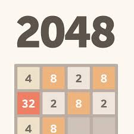
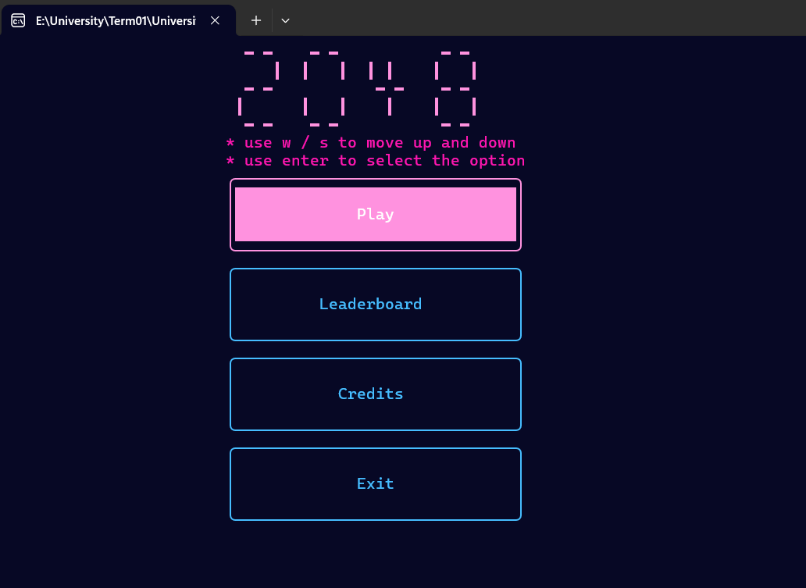
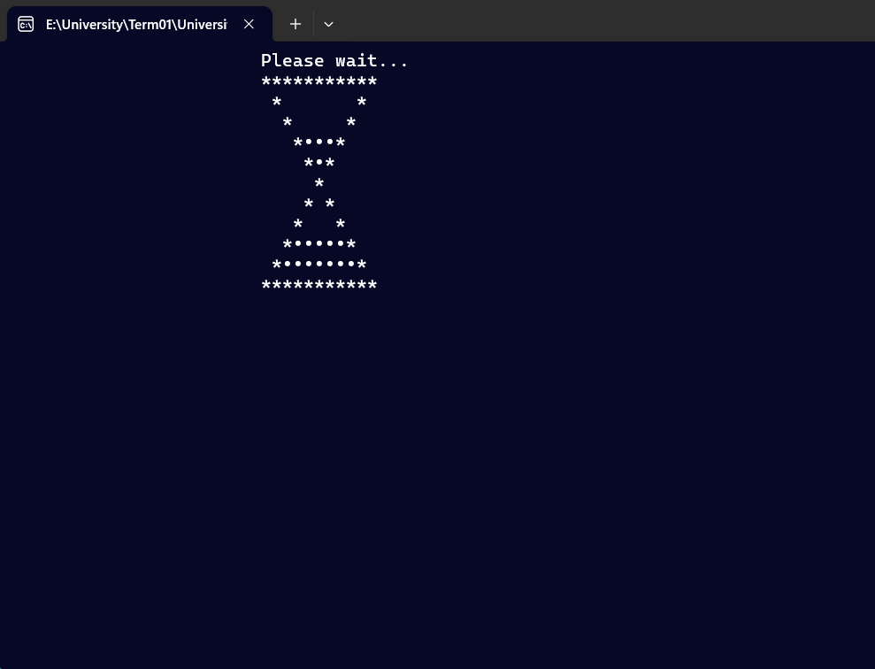
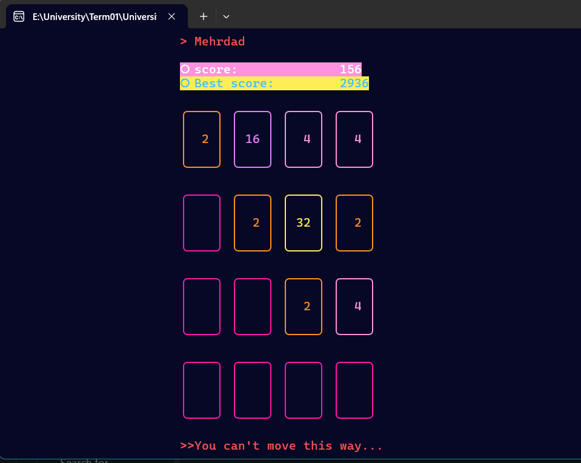

# 2048_ in Terminal, (BP Mini Project)

  

A simple **2048 puzzle game** implemented in **C++** as a mini project for a basic programming course. The game offers a classic 2048 experience with extra features to customize gameplay and track scores.

---

## Features

- 🎮 Classic 2048 gameplay mechanics  
- 🗂️ Main menu with intuitive navigation  
- 📏 Choose different board sizes (e.g., 4x4, 5x5, etc.)  
- 🏆 View and track best scores per board size  
- 📝 Enter player name for personalized experience  
- 📊 Leaderboard showing top scores filtered by board size  

---

## Screenshots


  
  
  

---

## How to Play

Use the arrow keys to move tiles in four directions. When two tiles with the same number collide, they merge into one with their sum. The goal is to reach the 2048 tile or achieve the highest possible score.

---

## Build & Run

1. Compile the source code using your favorite C++ compiler, e.g.:

```bash
g++ -o 2048game TheGame -std=c++17
```

2. Run the executable:
    
```bash
./2048game
```

---


## License

This project is open-source and free to use for educational purposes.

---

Enjoy the game and try to beat your best score! 🚀
